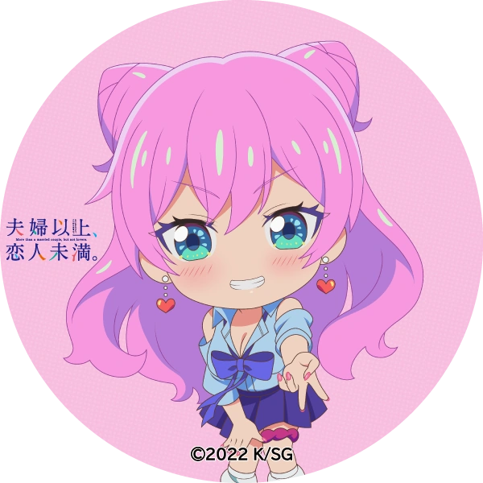

<!--
  ═══════════════════════════════════════════════════════════════
   ⚡ MYRAMM // [ ラム ] • CYBER-ANIME GITHUB PROFILE
   🌸 Featuring: Akari Watanabe (渡辺 星) • Fuufu Ijou, Koibito Miman
   🎌 Anime Ecosystem • AI Agents • Reverse Engineering • Go • Kotlin
  ═══════════════════════════════════════════════════════════════
-->

<div align="center">

  <!-- HEADER DYNAMIC BANNER -->
  <a href="https://github.com/myramm">
    
  </a>

  <!-- TYPING SVG SUBTITLE -->
  <p align="center">
    <a href="https://github.com/myramm">
      
    </a>
  </p>

  <!-- BADGES -->
  <p align="center">
    
    
    
    
  </p>

</div>

---

### 🌸 「 WAIFU & PROFILE // プロフィール 」

<table border="0">
  <tr>
    <td width="36%" align="center" valign="middle">
      
      <br/>
      <sub><b>🌸 渡辺 星 (Akari Watanabe)</b> — <i>Fuufu Ijou</i></sub>
    </td>
    <td width="64%" valign="top">

```yaml
identity:
  name: "myramm (ラム)"
  role: "Full-Stack Polyglot & Anime System Architect"
  location: "Indonesia 🇮🇩"
  muse: "Akari Watanabe (渡辺 星) 🌸"
  vibe: "Cyberpunk Otaku x Security & Reverse Engineering 🌌"
  specializations:
    - "Autonomous AI CLI Agents (Termux / Linux)"
    - "High-Performance Anime Streaming APIs & Android Clients"
    - "Android Reverse Engineering & Bytecode Manipulation (Smali/Java)"
    - "Bot Networks & Anti-Bot Bypass Systems (Cloudflare Turnstile Solver)"
  quote: "「 過去を悔やんでも、世界は変わらない。未来を創るコードを書け。」"
```

</td>
</tr>
</table>

---

### ⚔️ 「 ARSENAL & TECH STACK // 開発技術 」

<div align="center">

| Kategori | Teknologi & Tools |
| :--- | :--- |
| **Languages** |         |
| **Reverse Eng & Android** |    |
| **AI & LLM Infra** |     |
| **Backend & Cloud** |     |

</div>

---

### 🚀 「 FEATURED PROJECT SHOWCASE // 主なプロジェクト 」

<div align="center">

<table>
  <tr>
    <td width="50%" valign="top">
      <h3>🤖 <a href="https://github.com/myramm/r.outers">r.outers (rts)</a></h3>
      <p><b>Autonomous AI Coding Agent CLI for Android Termux & Linux.</b></p>
      <ul>
        <li>⚡ Multi-Provider routing (NVIDIA NIM 80+ Models, Clouvia, Atria)</li>
        <li>🛡️ Smart tool calling: Shell execution, live diffs, file I/O</li>
        <li>⌨️ Interactive terminal UI with arrow-key keyboard navigation</li>
        <li>🧩 Anti-Slop & Superpowers dynamic skill extensibility</li>
      </ul>
      <p><code>Python</code> • <code>Bash</code> • <code>CLI</code></p>
    </td>
    <td width="50%" valign="top">
      <h3>🎌 <a href="https://github.com/myramm/nime-api">nime-api</a> & <a href="https://github.com/myramm/kunime-api">kunime-api</a></h3>
      <p><b>High-performance REST API Gateway for Anime & Video Streaming.</b></p>
      <ul>
        <li>⚡ Automatic failover endpoints & multi-source scrapers</li>
        <li>🖼️ Dynamic poster caching & ultra-low latency response</li>
        <li>📱 Powers custom streaming Android apps & Web portals</li>
      </ul>
      <p><code>TypeScript</code> • <code>JavaScript</code> • <code>REST API</code></p>
    </td>
  </tr>
  <tr>
    <td width="50%" valign="top">
      <h3>📱 <a href="https://github.com/myramm/aniyomi">Aniyomi Custom & Kunime</a></h3>
      <p><b>Tailored Android Anime Streaming Client & Bytecode Engine.</b></p>
      <ul>
        <li>🎬 Custom anime-only fork optimized for seamless playback</li>
        <li>🔍 Smali bytecode reverse engineering & performance patches</li>
        <li>🧩 Custom scrapers extensions support</li>
      </ul>
      <p><code>Kotlin</code> • <code>Java</code> • <code>Smali</code></p>
    </td>
    <td width="50%" valign="top">
      <h3>🛡️ <a href="https://github.com/myramm/cfbyp">cfbyp & Automation Bots</a></h3>
      <p><b>Cloudflare Clearance & Turnstile Solver API & Bot Suite.</b></p>
      <ul>
        <li>🌐 Automated Turnstile & WAF challenge bypass gateway</li>
        <li>🤖 Telegram disposable email receiver & OTP notification bots</li>
        <li>🚀 High-concurrency Go bot system (<code>R-BOT-GOLANG</code>)</li>
      </ul>
      <p><code>Go</code> • <code>JavaScript</code> • <code>Docker</code> • <code>Python</code></p>
    </td>
  </tr>
</table>

</div>

---

### 📊 「 SYSTEM TELEMETRY & STATS // 統計データ 」

<div align="center">

  <!-- GITHUB STATS & STREAK (ANIME/TOKYO NIGHT THEME) -->
  <a href="https://github.com/myramm">
    
  </a>
  <a href="https://github.com/myramm">
    
  </a>

  <br/><br/>

  <!-- TOP LANGUAGES -->
  <a href="https://github.com/myramm">
    
  </a>

</div>

---

### 💖 「 AKARI'S SANCTUARY // 渡辺 星 」

<div align="center">

<table border="0">
  <tr>
    <td align="center" width="50%">
      
    </td>
    <td align="center" width="50%">
      
      <br/><br/>
      <blockquote>
        <i>「 次郎、ちゃんと見ててよね！ 」</i><br/>
        <b>— 渡辺 星 (Akari Watanabe)</b><br/>
        <sub><i>Fuufu Ijou, Koibito Miman</i></sub>
      </blockquote>
    </td>
  </tr>
</table>

<br/>

<!-- ANIME FOOTER BANNER -->
<a href="https://github.com/myramm">
  
</a>

<p align="center">
  <b>Crafted with 💖, ⚡ & 🌸 for Akari Watanabe by <a href="https://github.com/myramm">myramm</a></b>
</p>

</div>
